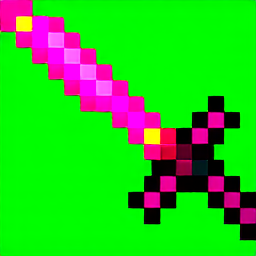
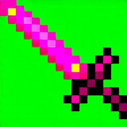
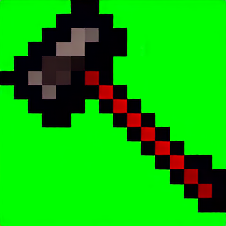

# MC Asset Generator

## What is the project?
The project is aimed at generating assets for Minecraft using cutting-edge Stable Diffusion models, such as SD3.5 Large.

## Goals
- Generate assets for Minecraft
- Create a programmatic script for training the LoRa model and running inference using pytorch.
- Update Stable diffusion model to 3.5 or 3.0
- Improve asset quality and consistency using either LoRa, ControlNet, or IP-Adapters/other techniques
- Investigate Dreambooth as an option for training an alternative checkpoint model.
# Achieved Goals
- Update Stable Diffusion Model to SD3.5 Large and train a new LoRa model for SD3.5 Large
## Data
- 3,000 labeled images of varying quality of Minecraft textures
Acquired from the following minecraft mods:

SpellBladeNext/Fabric (MIT)
Artifacts (MIT)
RLArtifacts (MIT)
Better End (MIT)
Better Nether (MIT)
Farmer's Delight (MIT)
Enderscape (MIT)Quark (CC BY-NC-SA 3.0)
TwilightForest (CC BY-NC-SA 4.0)
Nether's Delight (MIT)
Ice and Fire: Dragons (GNU Lesser General Public License)
Reliquary Reincarnations (GNU Lesser General Public License)
Alex's Mobs (GNU Lesser General Public License)
Botania (Botania custom license)
Ender IO (Public Domain based)
Immersive Armors (GNU Lesser General Public License)
End Remastered (Permission to train)
Overite (MIT)
Echoing Depths (MIT)
malcolmriley (Creative Commons Attribution 4.0 International)


## Packages Needed to Train
Do not install these yourself - there is a requirements.txt and instructions on when to install these after this section.
Pytorch
Pytorchvision
accelerate
huggingface-cli
xtransformers (if you decide to use the diffuser scripts from huggingface, not necessary for sd-scripts)
Any other requirements installed by Sd-scripts

## Running the code
This package makes use of the SD-Scripts for setting up the environment and running the training process for the LoRA,
as they are standard and much more advanced than my own, I also had great difficulty attempting to set up the huggingface diffusers library, so the SD-Scripts were the best option. Follow the instructions below to set up the SD-Scripts environment before beginning to train. To run the code, follow the instructions below to set up SD-Scripts from the training section, don't run the last accelerate command, and instead just run the python inference command instead, remembering to set the environment variable to a GPU ID that has at least 24GB of VRAM free.

## Training
To use the following you must have a GPU with at least 18GB of VRAM and 20GB of RAM locally. Or alternatively, use a cloud-based solution such as Google Colab or AWS SageMaker.
1. Download [Stable Diffusion 3.5 Large](https://huggingface.co/stabilityai/stable-diffusion-3.5-large) as your foundational model. Or you can attempt to train the LoRa model for a different foundational model for varying results, such as FLUX1.
2. Download Kohya SS to the machine or [SD-Scripts](https://github.com/kohya-ss/sd-scripts)
3. Once it is downloaded, ensure that you also download the transformer checkpoints from hugging face for SD 3.5 Large T5XXL, CLIP-L and CLIP-G from their hugging face files within the text encoders folder.

For SD-Scripts for Stable Diffusion 3
1. Switch to the SD3 branch
2. Set up your python venv, ensure your python version is at least 3.10, and that you have at least CUDA 12.2 installed on the machine
3. Install the required depependencies by doing pip3 install -r requirements.txt in the sd-scripts directory
4. Also install `pip3 install torch==2.4.0 torchvision==0.19.0 --index-url https://download.pytorch.org/whl/cu124` ensure that you change the `cu124` to the correct CUDA version - e.g CUDA 12.2 & 12.1 is `cu121` (Magic Environment) or CUDA 11.8 is `cu118`
5. Then do `accelerate config` - and set it up however you'd like. The easiest configuration is to say no to everything and select only 1 GPU for training.
6. After setting up accelerate config, reference the sd-scripts repository for more commands, however this is the command that I used for training:
```bash
accelerate launch --mixed-precision fp16 --num_cpu_threads_per_process 1 sd3_train_network.py \
--pretrained_model_name_or_path /home/jupyter-jrb326/.cache/huggingface/hub/models--stabilityai--stable-diffusion-3.5-large/snapshots/ceddf0a7fdf2064ea28e2213e3b84e4afa170a0f/sd3.5_large.safetensors \
--clip_l /home/jupyter-jrb326/.cache/huggingface/hub/models--stabilityai--stable-diffusion-3.5-large/snapshots/ceddf0a7fdf2064ea28e2213e3b84e4afa170a0f/text_encoders/clip_l.safetensors \
--clip_g /home/jupyter-jrb326/.cache/huggingface/hub/models--stabilityai--stable-diffusion-3.5-large/snapshots/ceddf0a7fdf2064ea28e2213e3b84e4afa170a0f/text_encoders/clip_g.safetensors \
--t5xxl /home/jupyter-jrb326/.cache/huggingface/hub/models--stabilityai--stable-diffusion-3.5-large/snapshots/ceddf0a7fdf2064ea28e2213e3b84e4afa170a0f/text_encoders/t5xxl_fp16.safetensors \
--cache_latents_to_disk \
--save_model_as safetensors \
--sdpa \
--persistent_data_loader_workers \
--max_data_loader_n_workers 2 \
--seed 42 \
--gradient_checkpointing \
--mixed_precision fp16 \
--save_precision fp16 \
--network_module networks.lora_sd3 \
--network_dim 4 \
--network_train_unet_only \
--optimizer_type adamw8bit \
--learning_rate 1e-4 \
--cache_text_encoder_outputs \
--cache_text_encoder_outputs_to_disk \
--highvram \
--max_train_epochs 4 \
--save_every_n_epochs 1 \
--dataset_config /home/jupyter-jrb326/dataset_config.toml \
--output_dir /home/jupyter-jrb326/output \
--output_name sd3-lora-mcgen
```
## Inference on LoRa
(Requires at least 20GB of VRAM with offloading, and 30GB of RAM for offloading) - Longer prompts will go over 24GB VRAM
1. To run inference on your LoRa checkpoints, I used the following commands:
```bash
CUDA_VISIBLE_DEVICES=2 python sd3_minimal_inference.py \
       --fp16 \
       --ckpt_path /home/jupyter-jrb326/.cache/huggingface/hub/models--stabilityai--stable-diffusion-3.5-large/snapshots/ceddf0a7fdf2064ea28e2213e3b84e4afa170a0f/sd3.5_large.safetensors \
       --clip_l /home/jupyter-jrb326/.cache/huggingface/hub/models--stabilityai--stable-diffusion-3.5-large/snapshots/ceddf0a7fdf2064ea28e2213e3b84e4afa170a0f/text_encoders/clip_l.safetensors \
      --clip_g /home/jupyter-jrb326/.cache/huggingface/hub/models--stabilityai--stable-diffusion-3.5-large/snapshots/ceddf0a7fdf2064ea28e2213e3b84e4afa170a0f/text_encoders/clip_g.safetensors \
       --t5xxl /home/jupyter-jrb326/.cache/huggingface/hub/models--stabilityai--stable-diffusion-3.5-large/snapshots/ceddf0a7fdf2064ea28e2213e3b84e4afa170a0f/text_encoders/t5xxl_fp16.safetensors \
       --prompt "A golden apple with a big M on the front" \
       --negative_prompt "blurry, low resolution" \
       --steps 50 \
       --cfg_scale 7.5 \
       --width 256 \
       --height 256 \
       --offload \
       --lora_weights /home/jupyter-jrb326/output/sd3-lora-mcgen-000002.safetensors;1.0 \
       --fp16
```


# Examples

## Cyberpunk Sword

Prompt: `Cyberpunk sword similar with a katana outline and a glowing edge in a neon color `

This example uses checkpoint 2 with 20 steps


This example uses checkpoint 2 with 50 steps


## Golden apple

Prompt: `Golden apple with a big M on the front`

## Hammers

Prompt: ` A minecraft war hammer in pixel art style only, maintain consistency, and ensure that the image is high quality, not blurry, is Oni Japanese Demon themed and is detailed`

This example uses checkpoint 2 with 20 steps


Prompt: `War hammer`

This example uses checkpoint 2 with 20 steps

